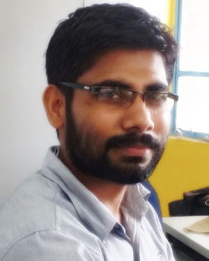

I’m a Senior Project Scientist at the [Indian Institute of Technology Mandi](https://www.iitmandi.ac.in/). I received a PhD in electronics and communication engineering from [National Institute of Technology Jalandhar](https://www.nitj.ac.in/) in 2022.

I’m an interdisciplinary researcher working at the intersection of Human-Computer Interaction, extended reality, physiological computing, wearable sensing, and intelligent interactive systems. My work focuses on the design and development of biofeedback technologies, immersive virtual environments, and multimodal interaction techniques for applications in healthcare, disaster resilience, human performance, and assistive technologies. My teaching emphasizes project-based and research-oriented learning supported by interactive tools and open-source technologies.

I mostly use open-source tools/technologies in my work. When I’m not researching, I enjoy exploring new ideas, learning new technologies, or building something fun and creative.
