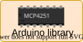

I am an avid supporter of open source technologies and use most of them for my projects. These are some of the open source projects I have made. Hope you’ll find them useful.

## Technical Projects

- 

  Biofeedback Nintendo Entertainment System

  BioNES \| Author

  [Arduino](#category=Arduino)

  [MATLAB](#category=MATLAB)

  [Biofeedback](#category=Biofeedback)

  [Video game](#category=Video%20game)

  A plug-and-play MATLAB based tool to use NES games for multimodal biofeedback

  - [Repository](https://github.com/kulbhushanchand/BioNES)
  - [v1.0.0](https://github.com/kulbhushanchand/BioNES/releases/tag/1.0.0)
  - [Documentation](https://kulbhushanchand.github.io/BioNES/)
  - Open Software
  - Open Hardware

  

  Arduino Firmata Data Acquisition

  AfDaq \| Author

  [Arduino](#category=Arduino)

  [MATLAB](#category=MATLAB)

  A plug and play MATLAB based tool for biofeedback and Arduino based instruments

  - [Repository](https://github.com/kulbhushanchand/AfDaq)
  - [v1.0.0](https://github.com/kulbhushanchand/AfDaq/releases/tag/1.0.0)
  - [Documentation](https://kulbhushanchand.github.io/AfDaq/)
  - Open Software

  

  MCP4251

  MCP4251 \| Author

  [Arduino](#category=Arduino)

  [Library](#category=Library)

  [Digital potentiometer](#category=Digital%20potentiometer)

  Arduino library for MCP4251 Digital Potentiometer

  - [Repository](https://github.com/kulbhushanchand/MCP4251)
  - [v1.0.0](https://github.com/kulbhushanchand/MCP4251/releases/tag/1.0.0)
  - [Documentation](https://kulbhushanchand.github.io/MCP4251/)
  - Open Software

  

  classroom-gamification

  classroom-gamification \| Author

  [Gamification](#category=Gamification)

  Tool to gamify your classroom with an online leaderboard

  - [Repository](https://github.com/kulbhushanchand/classroom-gamification)
  - [v1.1.2](https://github.com/kulbhushanchand/classroom-gamification/releases/tag/v1.1.2)
  - [Demo](https://kulbhushanchand.github.io/classroom-gamification/)
  - Open Software
