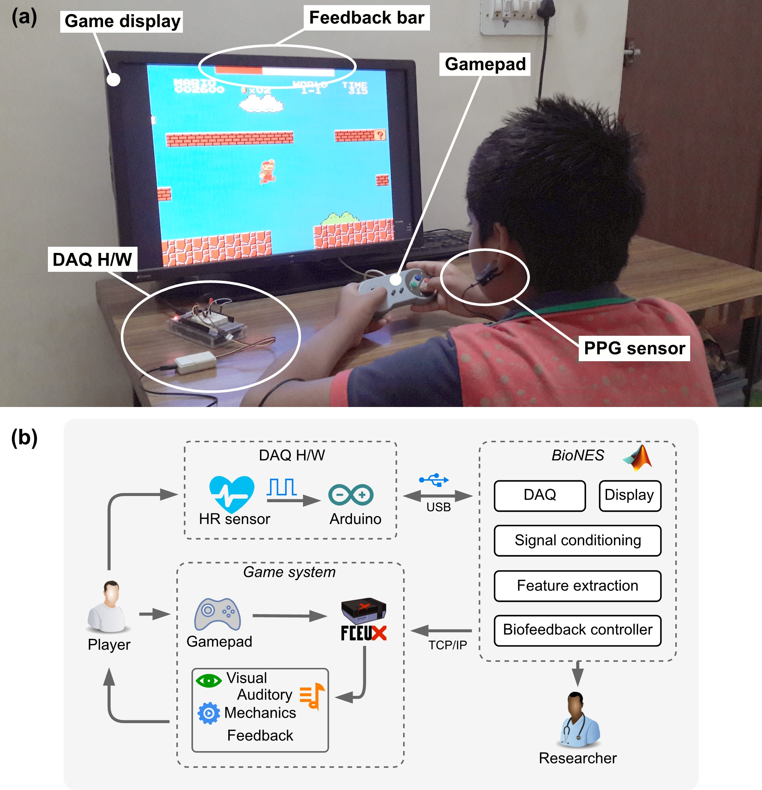
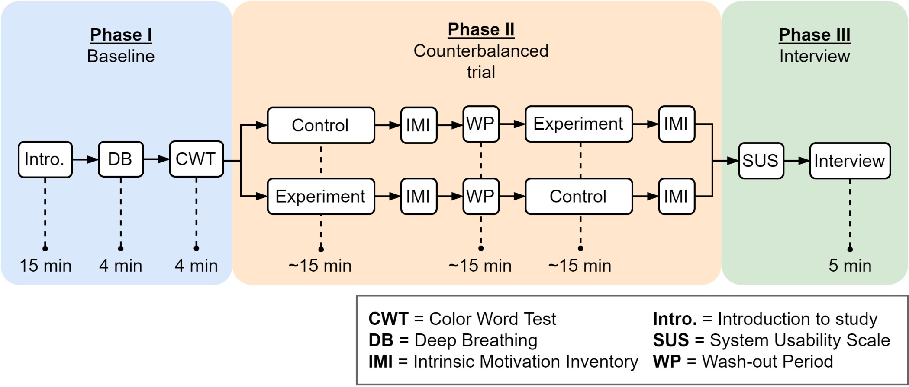
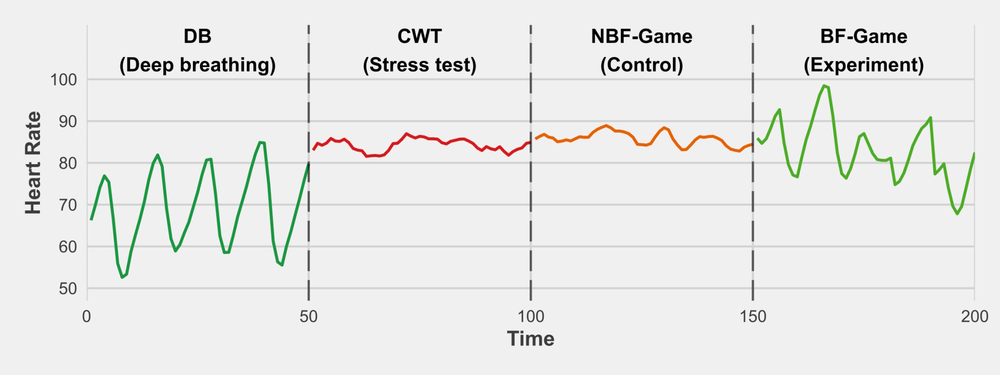

## Important links

- [Paper (open acess)](biofeedback-2022.pdf)
- [GitHub repository](https://kulbhushanchand.github.io/BioNES/)

## Abstract

Video games are used to increase the engagement of biofeedback systems. For cost-effectiveness, the original Nintendo Entertainment System (NES) games can be used. Therefore, a multimodal biofeedback system was developed to leverage the NES games for biofeedback. This study aims to test the efficacy of the developed system, the motivation of participants, and the usability of the system. A within-group design study was conducted with 16 participants followed through four interventions: deep breathing, stress-test, non-biofeedback game (control), and biofeedback game (experiment), where their HRV was recorded. Participants showed significantly different HRV during interventions (F(1.60, 23.93) = 11.94, p \< 0.001) and reported higher HRV when using biofeedback game than the non-biofeedback game (t(15) = 9.14, p \< 0.0001). The motivation was reported to be the same with biofeedback and non-biofeedback version of the game, and the overall system was reported as usable. The results of this study support the efficacy of using original NES games in biofeedback for mental relaxation.

## Important figures



Figure 1: (a) Participant interacting with the system during biofeedback intervention. The acquisition hardware is attached to the ear-lobe to acquire the PPG signal. The GUI of the acquisition S/W is behind the game window and not visible to the player. The in-game visual feedback bar is displayed at the top of the in-game screen. In the figure, the feedback bar is at the 3rd level or 60%-70% deviation of current HRV from the baseline HRV value of the player, (b) System block diagram showing the various components of the developed biofeedback system.



Figure 4: The phase-wise experiment design for the study. The three main phases are the baseline measurements, counterbalanced trials between control and experiment groups, and the final interview.



Figure 6: Respiratory Sinus Arrhythmia (RSA) was exhibited by participant 1 during the 4 different interventions. The RSA is pronounced in the DB and Experiment conditions, whereas desynchronization occurs in both CWT and control conditions.

## Citation

[ Add to Zotero ](https://www.zotero.org/save?type=doi&q=10.4018/IJGCMS.295874)

``` bibtex
@article{chand_efficacy_2022,
    title = {Efficacy of {Using} {Retro} {Games} in {Multimodal} {Biofeedback} {Systems} for {Mental} {Relaxation}},
    author = {Chand, Kulbhushan and Khosla, Arun},
    doi = {10.4018/IJGCMS.295874},
    journal = {International Journal of Gaming and Computer-Mediated Simulations (IJGCMS)},
    year = {2022},
    volume = {14},
    number = {1},
    pages = {1-23}}
```
