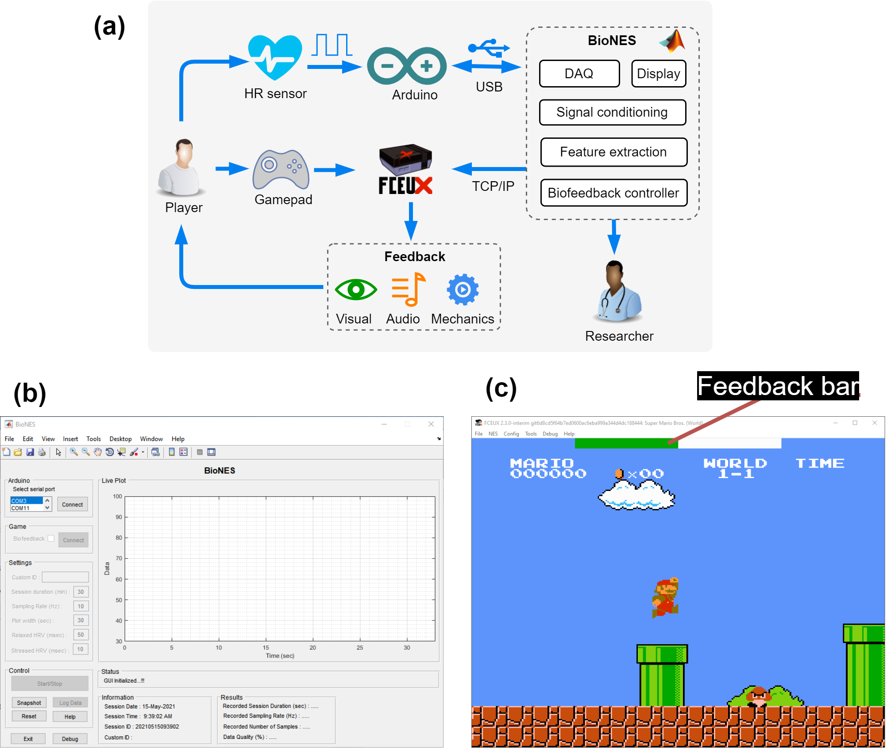
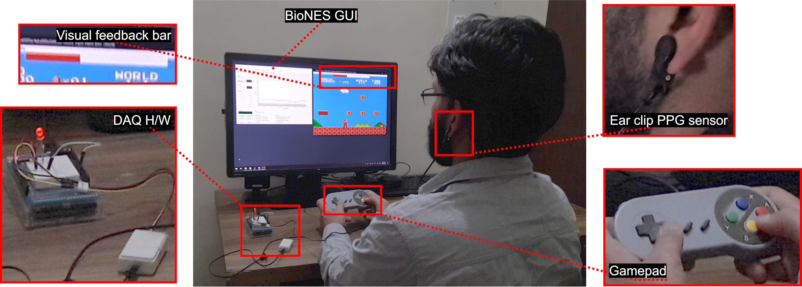

## Important links

- [Paper (open acess)](biones-2022.pdf)
- [GitHub repository](https://kulbhushanchand.github.io/BioNES/)

## Abstract

In the traditional biofeedback system, videogames are effectively used to increase engagement as a feedback delivery mechanism via changing in-game mechanics. The original 8-bit Nintendo Entertainment System (NES) games make them an excellent choice for biofeedback for their popularity and simple gameplay mechanics. For this, we present BioNES, which is a MATLAB-based GUI tool to leverage the NES games for multimodal biofeedback. The RR beats can be received from any Arduino compatible board to compute the heart rate variability (HRV). The deviation of HRV from baseline corresponds to the mental stress of the player and is used to compute feedback which is then delivered via NES game running in FCEUX emulator. The player can then use any relaxation protocol, like paced breathing to learn stress management during gameplay. The system performance and efficacy via randomized controlled trials have been proved in the separate open data research. The BioNES is meant to be a simple plug-and-play and affordable biofeedback solution for researchers without programming experience and casual users to use video games for health.

## Important figures



Figure 1: (a) Block diagram of overall biofeedback system. BioNES forms the software part for the system, (b) Graphical user interface of BioNES, (c) Screenshot of NES game running in FCEUX. The biofeedback bar (current position is at bar = 4) is shown at the top of the in-game screen.



Figure 5: The player interacts with the system during biofeedback intervention. The acquisition hardware is attached to the ear-lobe to acquire the PPG signal. The screen shows both the BioNES GUI and FCEUX window.

## Citation

[ Add to Zotero ](https://www.zotero.org/save?type=doi&q=10.1016/j.softx.2022.101184)

``` bibtex
@article{chand_biones_2022,
    title = {BioNES: A plug-and-play MATLAB-based tool to use NES games for multimodal biofeedback},
    author = {Chand, Kulbhushan and Khosla, Arun},
    doi = {10.1016/j.softx.2022.101184},
    journal = {SoftwareX},
    year = {2022},
    volume = {19},
    number = {1},
    pages = {101184}}
```
