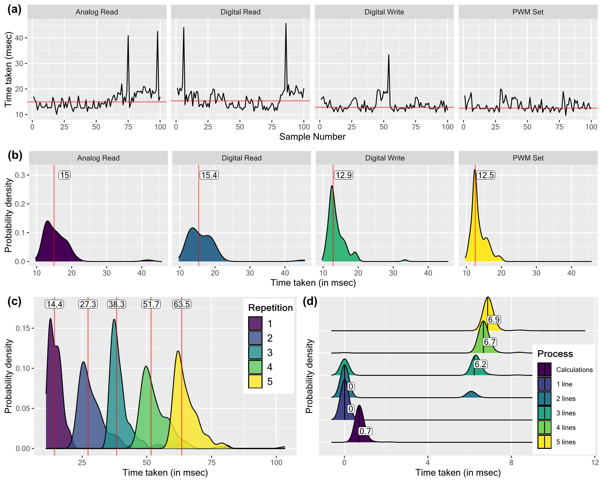
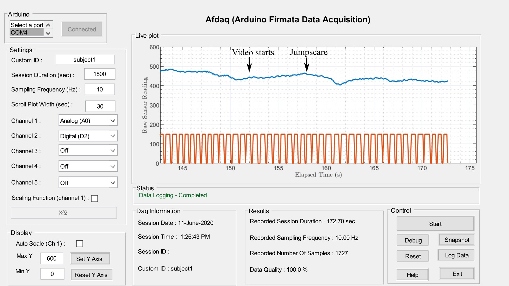

## Important links

- [Paper (open acess)](daq-2022.pdf)
- [GitHub repository](https://github.com/kulbhushanchand/AfDaq)

## Abstract

AfDaq is an open-source, plug-and-play, MATLAB-based tool that offers the capabilities of multichannel real-time data acquisition, visualization, manipulation, and local saving of data for offline analysis. The MATLAB Arduino package suffers from serious timing jitter during real-time data acquisition. This timing jitter associated with four main commands (analog read, digital read, digital write, and PWM set) available in MATLAB Arduino package is statistically analyzed, and a simple post-hoc timing jitter correction mechanism is proposed to acquire data points with high timing accuracy. The benchmark of the final program is conducted at various sampling rates for multichannel acquisition with 10 Hz comes as the maximum sampling rate for 5 channel recording. In the end, a use case of the developed tool for physiological data acquisition in multimodal biofeedback is presented. The software tool, data, and analysis scripts that support the findings of this study are released as an open-source project to support the replicability and reproducibility of the research.

## Important figures



Figure 4: (a) Timing jitter in MATLAB Arduino package for various commands computed for 100 samples, (b) Probability density plot of the timing jitter. The median value is represented by a red line in each plot, (c) Probability density plot of multiple calls to Analog Read command per sample, (d) Ridgeline probability density plot showing timing jitter associated with calculations and multiple line plots



Figure 9: Acquisition of EDA and HR signal (blue and orange lines respectively) from a subject using AfDaq. A short video clip containing jump scare is manually shown at marked time intervals.

## Citation

[ Add to Zotero ](https://www.zotero.org/save?type=doi&q=10.4018/JITR.299922)

``` bibtex
@article{chand_matlab-based_2022,
    title = {{MATLAB}-{Based} {Real}-{Time} {Data} {Acquisition} {Tool} for {Multimodal} {Biofeedback} and {Arduino}-{Based} {Instruments}: {Arduino} {Firmata} {Data} {Acquisition} ({AfDaq})},
    author = {Chand, Kulbhushan and Khosla, Arun},
    doi = {10.4018/JITR.299922},
    journal = {Journal of Information Technology Research (JITR)},
    year = {2022},
    volume = {15},
    number = {1},
    pages = {1-20}}
```
