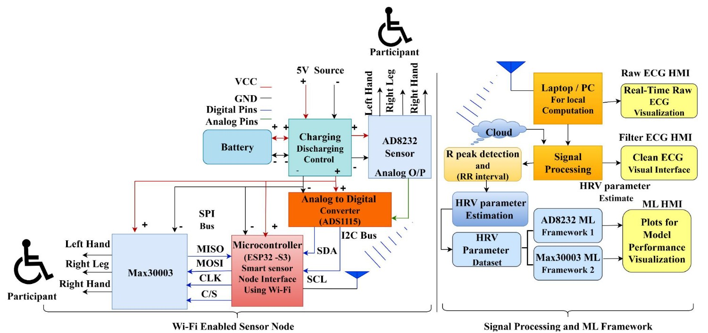

## Important links

- [Supplementary data (open acess)](https://doi.org/10.21227/s3dc-hd94)

## Abstract

Affordable and accurate cardiovascular monitoring is a pervasive issue in resource-constrained and rural settings, where sophisticated clinical-grade electrocardiogram (ECG) devices are exorbitantly expensive. Low-cost ECG sensors available today are prone to motion artifacts and noisy signals, limiting their use to heart rate variability (HRV) estimation. To fill this gap, we present a proof-of-concept system calibrating noisy, wearable ECG-based HRV measurements using machine learning (ML) models, against a gold standard clinical-grade sensor. Our objective is to evaluate the feasibility of accurate HRV prediction i.e., SDNN and RMSSD using low-cost sensors (AD8232, MAX30003) using ensemble and regression-based ML models. Data were collected in semi-controlled wearable settings, digital-filtered preprocessed, and processed with model ensembles optimized for generalizability. The top-performing models yielded RMSEs of 14.09 ms (SDNN) and 9.09 ms (RMSSD), with sensor type variable performance. In addition to signal calibration, the system includes a real-time human–machine interface (HMI) with wireless ECG visualization and feedback, integrated by an IoT-capable microcontroller. While preliminary and unclinically validated, our results suggest ML-augmented low-cost ECG systems to be feasible for scaled telehealth and affect-aware applications.

## Important figures



Figure 1: The weighted ensemble learning framework for HRV parameter prediction from AD8232 and MAX30003 low-cost sensor data against BitBrain reference recordings.

## Citation

[ Add to Zotero ](https://www.zotero.org/save?type=doi&q=10.1109/JSEN.2025.3593819)

``` bibtex
@article{kumar_affordable_2025,
    title = {Affordable {ECG} {Sensing}: {A} {Machine} {Learning}-{Enhanced} {Framework} for {Scalable} {Human}-{Machine} {Interaction} in {Telehealth}},
    author = {Kumar, Yashwant and Garg, Shreya and Agarwal, Peeyush and Chand, Kulbhushan and Bhavsar, Arnav and Dutt, Varun},
    doi = {10.1109/JSEN.2025.3593819},
    journal = {IEEE Sensors Journal},
    year = {2025},
    volume = {TBA},
    number = {TBA},
    pages = {TBA}}
```
